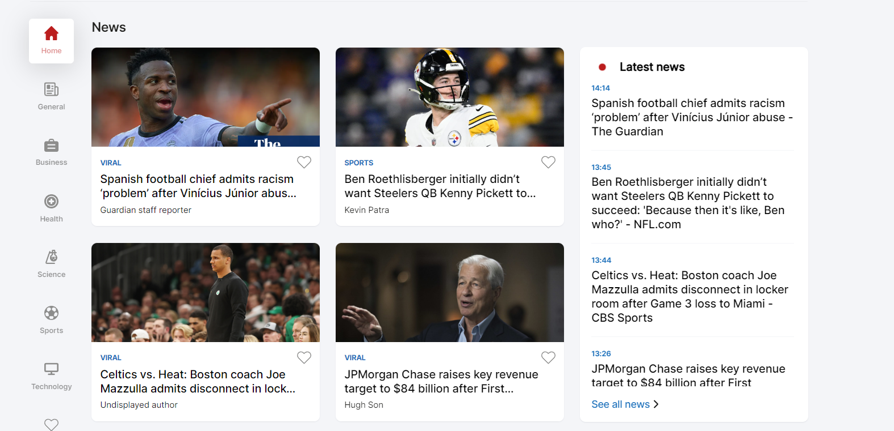
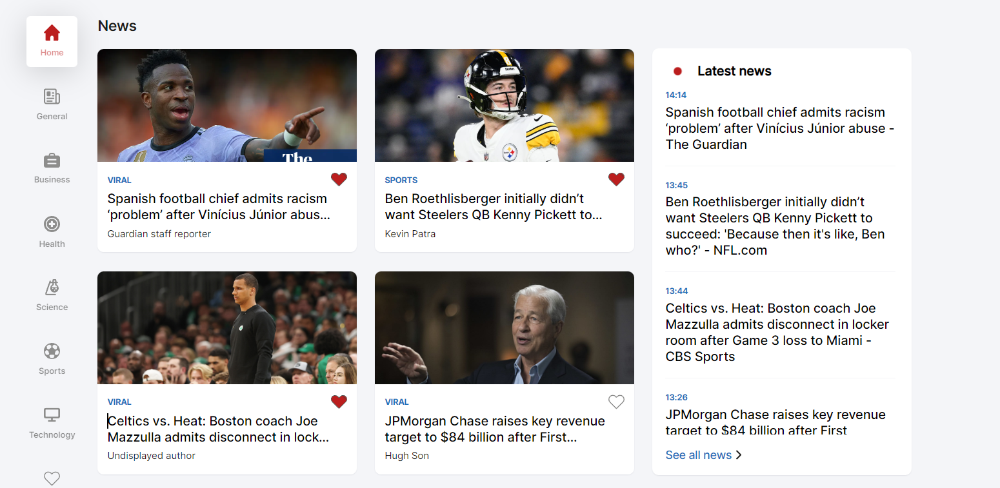
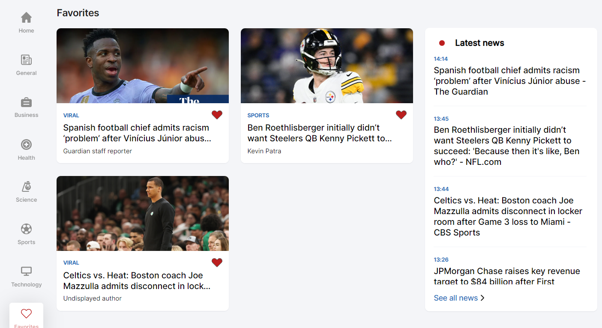

### News Application Project

The goal of the project was to create a Landing page with the display of news cards containing neccessary information about different news articles. Key functionalities to implement were:

- Search bar: Enter a certain key word and the landpage should display news based on the search in the title of the news card
- Categories: Search news by categories
- Favorites: Added a news card to favorites and remove favorites.

Design was made prehandedly by some very talented desinger/s

## Folder structure

Folder structure begins with `src` folder. That is the main folder which then has subfolders in the following order:

- api folder: `api` folder has a `fetch.ts` file which fetches all the news depending on the parameters it takes, and it also has a `map.ts` file which maps all the data accordingly.

- assets folder: the `assets` folder has two subfolders: `fonts` for imported fonts and `images` for all the images needed for the project

- components folder: a folder which contains code that is used repeadetly throughout the project. Such components would be icons, buttons, cards etc.

- context folder: `context` folder contains 4 different contexts and providers that were used in the app.
  The first context is the `CategoriesContext` which is used for containing the selected category.
  The second context is the `FavoritesContext` which is used for containg all the favorites. This context was also used together with localStorage to remember the favorites.
  The third context is the `SearchContext` which is used to contain the string used for searching.
  The fourth and last context is `ModalContext` which is used to contain the boolean of if the modal nav bar is open or closed.

- pages folder: the `pages` folder has two subfolders: `error` subfolder which contains the error page and `home` subfolder which contains the home page. The home page is divided based on the sections which in this case are the navigation bar, the categories section, the news section and the latest news section.

- styles folder: the `styles` folder contains all the CSS used in the project.

## Favorites functionality

The favorites functionality wasn't designed and was allowed for me to freely use any design and functionality. The design approach I used was the heart icons.

This would be the layout with just empty hearts displayed:

This would be the layout with some of the cards favorited:

This is how the favorites looks like:

This project was written in react.js, the news data was pulled from the news API, for data storing local storage was used, and SASS was used for CSS.
